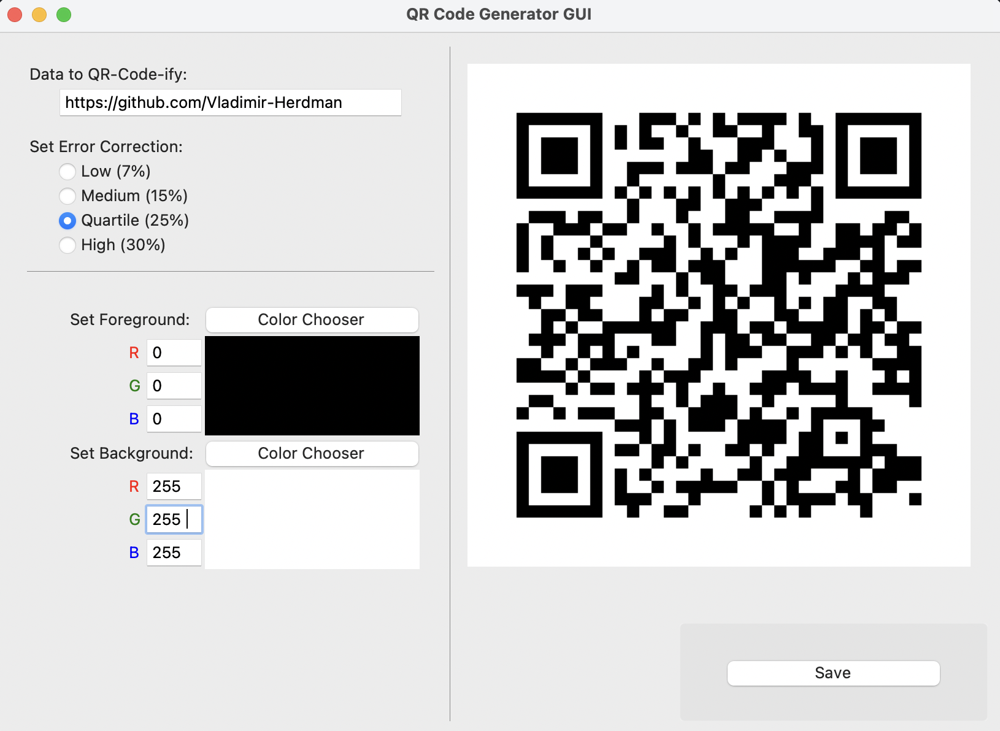
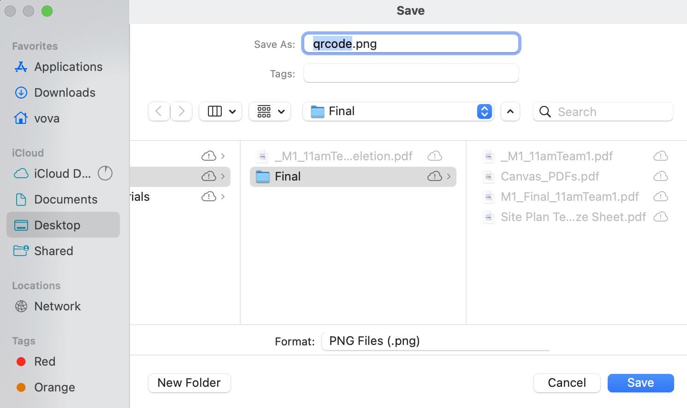

# QR Code Generator
Essentially, I recently learnt a close friend of mine had to pay a monthly
fee (about $1) for a QR code that would otherwise deprecate if he didn't pay.

That sounds like an absolute scam, *a QR code that deprecates?*  Unbelievable.
I looked into it, and there's already a python library `qrcode` that can 
generate QR codes on data given to it.  That's all fine and dandy, but 
I didn't want to just tell him that.  So, I created this tkinter interface 
to simplify the QR code stylization and creation process for him, and now 
his hiking club isn't using fees for QR codes when creating club promotional 
material.  You can just create it, it updates as you write, and then you can 
save a PNG or SVG of the QR code, it's scannable by any phone that supports
such functionality!

It's also nice for me, I got a QR code generator I like playing with, and can 
one day create a deprecating QR code site to take advantage of similar situations ;)

<!-- Video and Documentation -->
https://github.com/user-attachments/assets/6ea7c28b-2a63-4759-9fad-166bfeff8141

